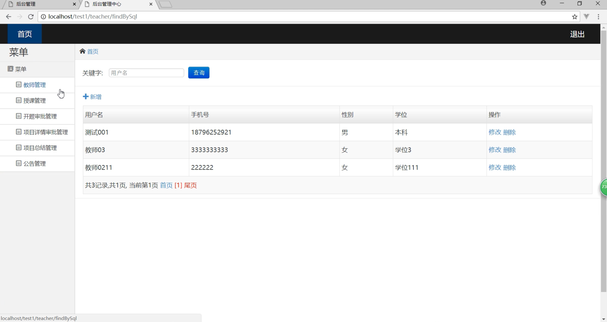
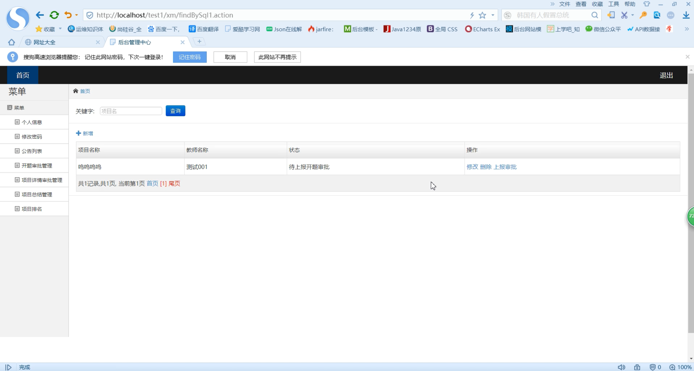
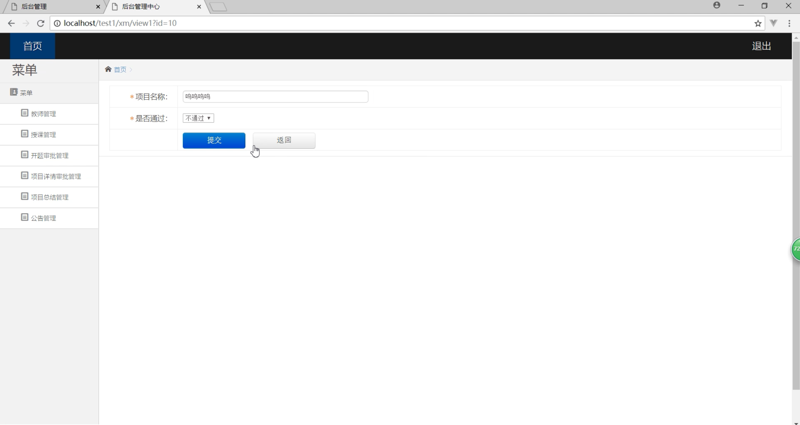
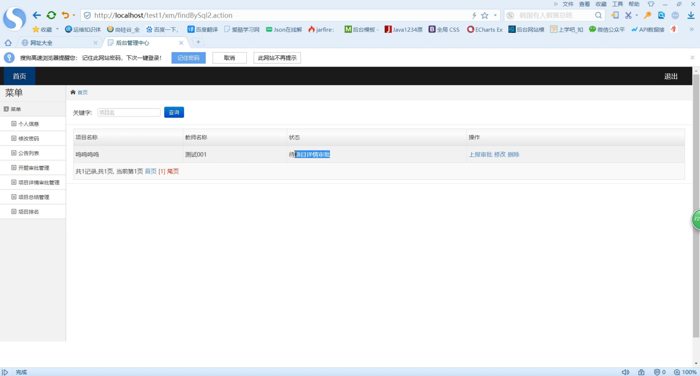
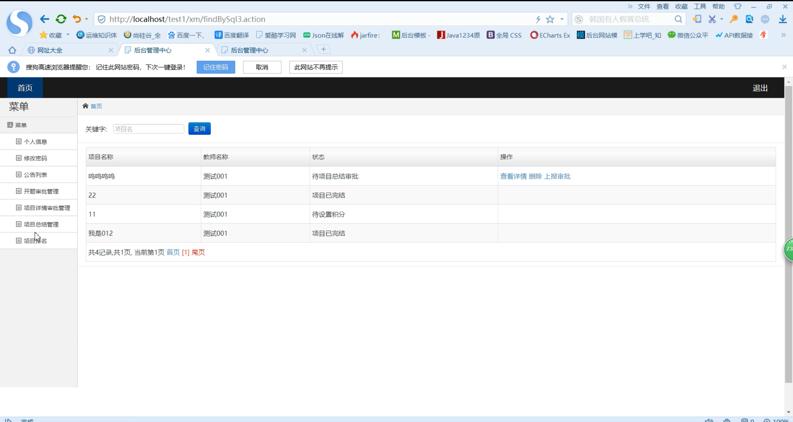

## 基于SSM框架的师资管理系统

###  获取sql数据库文件: 从戎源码网 (https://armycodes.com/) QQ: 386869957 QQ群: 377586148
###  所有系统地址: (https://github.com/YuLin-Coder/AllProjectCatalog) 
###  所有项目以及源代码本人均调试运行无问题 可支持远程安装部署调试、定制修改、代码讲解

## 项目介绍
基于SSM框架的师资管理系统，系统分为教师和管理员两个角色，主要功能如下

【教师】
个人信息、修改密码、公告列表、开题审批管理、项目详情审批管理、项目总结管理、项目排名
【管理员】
教师管理、授课管理、开题审批管理、项目详情审批管理、项目总结管理、公告管理

## 项目技术
- 编程语言：Java
- 数据库：MySQL
- 前端技术：JSP、JavaScript、jquery
- 后端技术：Spring、SpringMVC、MyBatis

## 运行环境
- JDK版本：JDK1.8及以上
- 开发工具：IDEA、Ecplise、Myecplise都可以
- 数据库: MySQL5.7及以上

## 运行截图

